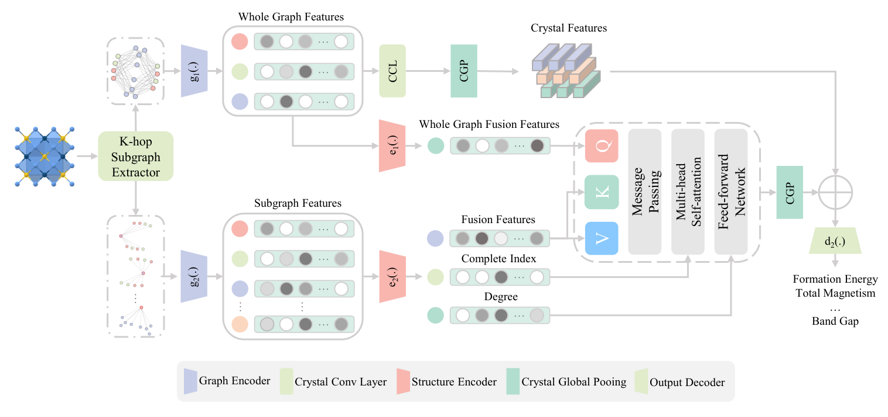

# SACGT Magnetism Preview

**Motif-aware crystal learning for interpretable magnetic reasoning in correlated solids.**

> This is a **pre-publication preview repository** for selected figures, visual assets, and lightweight plotting utilities associated with SACGT, the Structure-Aware Crystal Graph Transformer. Full training code, model weights, large-scale datasets, and screening tables are intentionally withheld until manuscript publication.

<p align="center">
  
</p>

## Why SACGT?

Magnetic quantum materials are hard to screen because their properties are not decided by a single atom, bond, or scalar descriptor. They emerge from **local motifs**, **medium-range exchange pathways**, and **lattice-scale periodic order** acting together. SACGT is designed around that idea: it combines periodic crystal context with two-hop motif retrieval and topology-gated attention, aiming to make crystal-property prediction not only accurate, but also physically interpretable.

In the manuscript, SACGT is used to:

- learn crystal properties directly from atomic structures under periodic boundary conditions;
- improve magnetic-property prediction relative to common crystal graph baselines;
- decompose total magnetization into trend-level site contributions using structure-aware attribution;
- support high-throughput screening of two-dimensional ferromagnetic semiconductor candidates;
- highlight 1T-CrS2H as a candidate with coupled spin and valley responses.

## What is included here?

This repository contains only material that is safe to show before publication:

```text
assets/figures/main/             Main manuscript figure PDFs and PNG previews
assets/figures/supplementary/    Selected supplementary figure PDFs and PNG previews
scripts/                         Lightweight plotting/figure utility scripts
docs/                            Pre-publication access notes and figure inventory
examples/                        Placeholder folder for future public demos
```

## What is intentionally not included?

To protect the unpublished work and avoid premature disclosure, this preview repository does **not** include:

- model weights or checkpoints;
- training, validation, or screening datasets;
- full Materials Project or C2DB-derived tables;
- complete high-throughput candidate lists;
- manuscript LaTeX source or submission materials;
- API keys, local paths, logs, or internal experiment archives;
- full training/inference code for SACGT.

A complete reproducibility release is planned after the manuscript is accepted or otherwise cleared for public release.

## Figure gallery

| Figure | Preview | Description |
|---|---|---|
| Figure 1 | [`figure1.pdf`](assets/figures/main/figure1.pdf) | SACGT architecture and motif-aware periodic representation |
| Figure 2 | [`figure2.pdf`](assets/figures/main/figure2.pdf) | Benchmark performance and scaling behavior |
| Figure 3 | [`figure3.pdf`](assets/figures/main/figure3.pdf) | Interpretable magnetic reasoning in Ti2O3 |
| Figure 4 | [`figure4.pdf`](assets/figures/main/figure4.pdf) | 2D ferromagnetic semiconductor screening and CrS2H validation |
| Supplementary Fig. 1 | [`supp_credibility_expanded_matrix.pdf`](assets/figures/supplementary/supp_credibility_expanded_matrix.pdf) | Attribution credibility audit |
| Supplementary Fig. 2 | [`supp_2d_saig_panel10.pdf`](assets/figures/supplementary/supp_2d_saig_panel10.pdf) | SA-IG attribution panel for representative 2D candidates |

## Repository status

This repository is a **curated public preview**, not the final code release.

If you are a reviewer, editor, or collaborator and need access to restricted materials, please contact the corresponding authors through the manuscript submission channel.

## Citation

A formal citation will be added after publication. For now, please cite this repository only as a pre-publication figure preview for the SACGT manuscript.

```bibtex
@misc{sacgt_preview_2026,
  title  = {SACGT Magnetism Preview: Motif-aware crystal learning for interpretable magnetic reasoning},
  author = {SACGT authors},
  year   = {2026},
  note   = {Pre-publication preview repository}
}
```

## License and reuse

All content is provided for **preview and scholarly evaluation only** before publication. Reuse, redistribution, model reconstruction, or derivative screening based on these materials is not permitted without written permission from the authors.

See [`LICENSE`](LICENSE) and [`docs/PREPUBLICATION_ACCESS.md`](docs/PREPUBLICATION_ACCESS.md).
